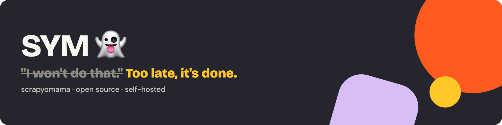

<a href="README.md">English</a> · <a href="README.fr.md">Français</a>

<p><picture>
  <source media="(prefers-color-scheme: dark)" srcset="assets/brand/banner-dark.png">
  <source media="(prefers-color-scheme: light)" srcset="assets/brand/banner-light.png">
  </picture></p>

<p><a href="https://github.com/scrap-yo-mama/sym/blob/main/LICENSE"></a>    </p>

Tu demandes des données à ton IA. **SYM 👻** enquête sur le site en commençant par le moins cher (requête simple, puis navigateur, puis agent), te montre le schéma et attend ton OK. Ensuite il compile une API qui rejoue **sans LLM** quand la stratégie le permet, et se répare quand le site change. Ton serveur, ta base, ton modèle.

> [!WARNING]
> **Pré-version.** SYM est en plein développement et n'est pas encore prêt pour la production. Suis le dépôt pour la première version.

## Ce que ça donne

```text
toi> Récupère les livres de books.toscrape.com avec titre et prix.
SYM 👻 : OK, je m'en occupe.
1/4 décrire · 2/4 enquête (access ok) · 3/4 schéma · 4/4 essai : fetch direct, ok
SYM 👻 : C'est fait. 20 livres, aucun coût de modèle par rejeu.
```

<table>
<tr>
<td valign="top" width="50%">

## Ce que SYM fait

- Transforme une demande en schéma que tu valides d'abord
- Choisit la méthode la moins chère qui marche
- Rejoue sans LLM quand la stratégie le permet, répare étape par étape
- Utilise ta propre session de navigateur quand tu l'autorises
- Parle MCP et REST, et a une console

</td>
<td valign="top" width="50%">

## Ce que SYM sait gérer

- Les pages lourdes en JavaScript, avec un vrai navigateur
- Les sites à compte, avec ta propre session (extension Chrome)
- Les sites retors : un agent se débrouille, puis ça se compile
- Les sites qui changent : il répare l'étape qui a cassé
- Pagination, planifications, webhooks

</td>
</tr>
</table>

## Démarrage rapide

```bash
git clone https://github.com/scrap-yo-mama/sym && cd sym/runtime
(
  umask 077
  set -C
  {
    echo "MASTER_KEY=$(openssl rand -base64 32)"
    echo "ADMIN_BOOTSTRAP_TOKEN=$(openssl rand -base64 32)"
  } > .env
)
docker compose up --build
```

 <sub>arrive avec la première version · compte Render requis</sub>

## Vérifie ce que tu lances

```bash
cosign verify ghcr.io/scrap-yo-mama/sym:X.Y.Z \
  --certificate-identity=https://github.com/scrap-yo-mama/sym/.github/workflows/release.yml@refs/tags/vX.Y.Z \
  --certificate-oidc-issuer=https://token.actions.githubusercontent.com
gh attestation verify oci://ghcr.io/scrap-yo-mama/sym:X.Y.Z -R scrap-yo-mama/sym
sha256sum -c SHA256SUMS
```

Remplace `X.Y.Z` par une version publiée : rien n'est publié avant la première version.

Le [cœur](https://github.com/scrap-yo-mama/sym/blob/main/runtime/TRADEMARK.md) est sous [AGPL-3.0](https://github.com/scrap-yo-mama/sym/blob/main/LICENSE), le client et les schémas sous MIT. [Usage responsable](https://github.com/scrap-yo-mama/sym/blob/main/runtime/apps/docs/content/explications/usage-responsable.md) : voir la [doc](https://github.com/scrap-yo-mama/sym/blob/main/runtime/apps/docs/content/index.md). Sécurité : le [signalement privé des failles](https://github.com/scrap-yo-mama/sym/blob/main/runtime/SECURITY.md) est activé. Fait avec l'aide d'une IA, relu par des humains. [Lire en anglais](README.md).
